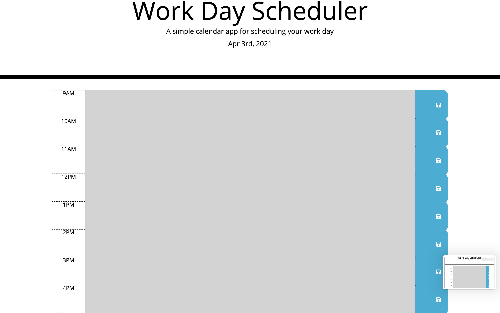

# work-schedule-planner
## Description
This project is made for scheduling reasons you simply enter what your going to do for the day and it stores the information in the time blocks, if you leave the app and come back your information will be saved until you delete it yourself.the color red would indicate that its present time the grey would indicate its the past and the green would be future time. 

## Installation
 you can clone code from repository in github link and bring it down to your local drive. From thier you can use visual studio code as your ide or any other is fine.then open in browser. here is a link to the actual website https://johnbatista1223.github.io/work-schedule-planner/ where you can check it out.
## Usage
 clone the repo from https://github.com/johnbatista1223/work-schedule-planner you can use visual studio code as ide then open in google chrome or any browser. the usage of this app is for daily scheduling you can simply insert what you need to be done in the text boxes and it saves until your done with the task.
 

## License
MIT License

Copyright (c) [2021] [john batista]

Permission is hereby granted, free of charge, to any person obtaining a copy
of this software and associated documentation files (the "Software"), to deal
in the Software without restriction, including without limitation the rights
to use, copy, modify, merge, publish, distribute, sublicense, and/or sell
copies of the Software, and to permit persons to whom the Software is
furnished to do so, subject to the following conditions:

The above copyright notice and this permission notice shall be included in all
copies or substantial portions of the Software.

THE SOFTWARE IS PROVIDED "AS IS", WITHOUT WARRANTY OF ANY KIND, EXPRESS OR
IMPLIED, INCLUDING BUT NOT LIMITED TO THE WARRANTIES OF MERCHANTABILITY,
FITNESS FOR A PARTICULAR PURPOSE AND NONINFRINGEMENT. IN NO EVENT SHALL THE
AUTHORS OR COPYRIGHT HOLDERS BE LIABLE FOR ANY CLAIM, DAMAGES OR OTHER
LIABILITY, WHETHER IN AN ACTION OF CONTRACT, TORT OR OTHERWISE, ARISING FROM,
OUT OF OR IN CONNECTION WITH THE SOFTWARE OR THE USE OR OTHER DEALINGS IN THE
SOFTWARE.
